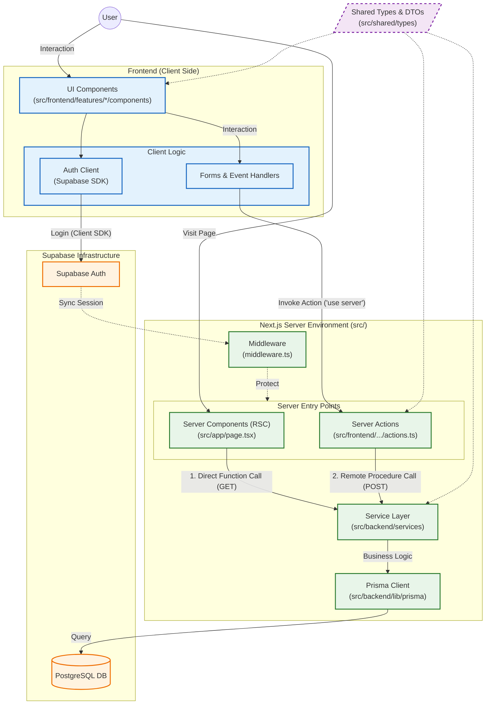

# Flowva System Architecture

This document outlines the high-level architecture of the Flowva project, following the **Modular Monolith** pattern with **Next.js Server Actions**.
The architecture emphasizes a clear separation between Client and Server logic, while leveraging Next.js 16's capability to call server functions directly.

## 🏗 Architecture Diagram

## 🧩 Key Concepts

### 1. Frontend (Client Components)
- **UI Components**: Located in `src/frontend/features/[feature]/components`.
- **Client Logic**: Minimal logic, primarily form handling and calling Server Actions.
- **Auth**: Uses Supabase Client SDK for direct authentication.

### 2. Server Entries
- **Server Components (RSC)**: Fetch data directly via Services during initial render (`page.tsx`).
- **Server Actions**: Handle mutations (POST/PUT/DELETE) invoked by client events. Located in `src/actions` or feature folders.

### 3. Backend Logic (Pure Server)
- **Service Layer**: Contains all business logic and authorization checks. Located in `src/backend/services`.
- **Prisma Client**: Direct database access, only called by the Service Layer.

### 4. Data Flow
1. **User Interaction** triggers a Form or Event.
2. **Server Action** is invoked directly (`use server`).
3. **Service Layer** processes the request.
4. **Database** is updated via Prisma.
5. **UI** updates (via `revalidatePath` or optimistic updates).
