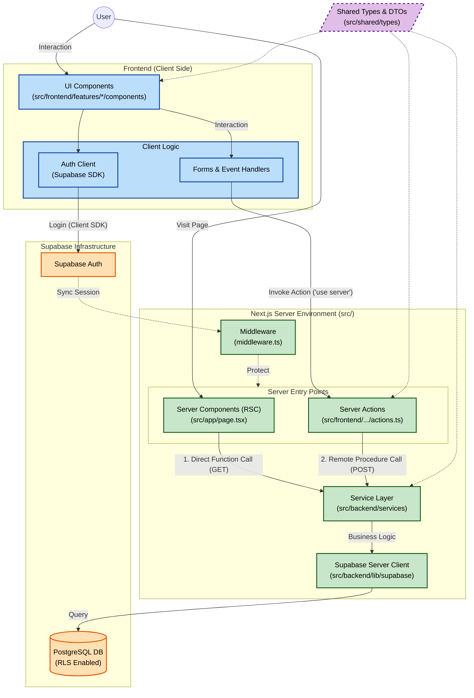

# Flowva — System Architecture

Tài liệu mô tả kiến trúc hệ thống của Flowva, theo mô hình **Supabase-Native Modular Monolith** với **Next.js 16 Server Actions**.

---

## 🏗 Architecture Diagram


```mermaid
graph TD
    User((User))

    %% --- FRONTEND CONTEXT ---
    subgraph FE ["Frontend (Client Side)"]
        direction TB
        UI["UI Components<br/>(src/frontend/features/*/components)"]

        subgraph ClientLogic ["Client Logic"]
            AuthHook["Auth Client<br/>(Supabase SDK)"]
            FormHandler["Forms & Event Handlers"]
        end

        UI -->|"Interaction"| FormHandler
        UI --> AuthHook
    end

    %% --- SHARED CONTRACT ---
    Contract[/"Shared Types & DTOs<br/>(src/shared/types)"/]

    %% --- BACKEND / SERVER CONTEXT ---
    subgraph Server ["Next.js Server Environment (src/)"]
        direction TB

        Middleware["Middleware<br/>(middleware.ts)"]

        subgraph EntryPoints ["Server Entry Points"]
            RSC["Server Components (RSC)<br/>(src/app/page.tsx)"]
            S_Action["Server Actions<br/>(src/frontend/.../actions.ts)"]
        end

        Service["Service Layer<br/>(src/backend/services)"]
        Repo["Supabase Server Client<br/>(src/backend/lib/supabase)"]

        Middleware -.->|"Protect"| EntryPoints
        RSC -->|"1. Direct Function Call (GET)"| Service
        S_Action -->|"2. Remote Procedure Call (POST)"| Service
        Service -->|"Business Logic"| Repo
    end

    %% --- INFRASTRUCTURE ---
    subgraph Infra ["Supabase Infrastructure"]
        SB_Auth["Supabase Auth"]
        SB_DB[("PostgreSQL DB<br/>(RLS Enabled)")]
    end

    %% --- EXTERNAL CONNECTIONS ---
    User -->|"Visit Page"| RSC
    User -->|"Interaction"| UI

    AuthHook -->|"Login (Client SDK)"| SB_Auth
    SB_Auth -.->|"Sync Session"| Middleware

    FormHandler -->|"Invoke Action ('use server')"| S_Action
    Repo -->|"Query"| SB_DB

    Contract -.-> S_Action
    Contract -.-> Service
    Contract -.-> UI

    %% STYLING
    classDef fe fill:#BBDEFB,stroke:#0D47A1,stroke-width:2px,color:#000000;
    classDef server fill:#C8E6C9,stroke:#1B5E20,stroke-width:2px,color:#000000;
    classDef infra fill:#FFE0B2,stroke:#E65100,stroke-width:2px,color:#000000;
    classDef shared fill:#E1BEE7,stroke:#4A148C,stroke-width:2px,stroke-dasharray: 5 5,color:#000000;

    class UI,ClientLogic,AuthHook,FormHandler fe;
    class Middleware,RSC,S_Action,Service,Repo server;
    class SB_Auth,SB_DB infra;
    class Contract shared;
```

---

## 📂 Cấu Trúc Thư Mục

```
flowva/
├── .agent/                     # Cấu hình AI Agent (skills, workflows)
│
├── supabase/                   # Supabase CLI — quản lý DB local & migration
│   ├── migrations/             # [QUAN TRỌNG] Lịch sử thay đổi schema DB (SQL files)
│   ├── snippets/               # Các đoạn SQL tiện ích (seed data...)
│   └── config.toml             # Cấu hình Supabase local (ports, auth...)
│
├── src/
│   ├── app/                    # Next.js App Router — chỉ chứa Routing & Layout
│   │   ├── (auth)/             # Route group: trang đăng nhập / đăng ký
│   │   ├── (main)/             # Route group: app chính (yêu cầu đăng nhập)
│   │   │   ├── dashboard/      # Trang tổng quan dự án
│   │   │   ├── chat/           # Tính năng chat (Discord-like)
│   │   │   └── calendar/       # Tính năng lịch
│   │   ├── projects/           # Trang chọn / quản lý dự án
│   │   ├── layout.tsx          # Root layout (fonts, metadata)
│   │   └── global.css          # Tailwind CSS v4 — file style chính
│   │
│   ├── backend/                # Server-side only — KHÔNG import vào Client Component
│   │   ├── services/           # [CỐT LÕI] Business logic & tất cả query Supabase
│   │   └── lib/supabase/       # Khởi tạo Supabase Client (server / browser / admin)
│   │
│   ├── frontend/               # Client-side UI — quản lý theo tính năng (Feature-based)
│   │   ├── features/           # Mỗi tính năng là 1 folder độc lập
│   │   │   ├── auth/           # Đăng nhập, đăng ký
│   │   │   ├── tasks/          # Quản lý task (Kanban board)
│   │   │   ├── dashboard/      # Widget thống kê, activity feed
│   │   │   ├── chat/           # Giao diện chat, reactions, mentions
│   │   │   ├── calendar/       # Giao diện lịch
│   │   │   └── landing/        # Trang chủ (chưa đăng nhập)
│   │   ├── components/         # UI component dùng chung (Button, Modal, Input...)
│   │   └── lib/                # Utilities dùng chung (cn, format, hooks...)
│   │
│   └── shared/                 # Contracts — dùng cho cả frontend lẫn backend
│       └── types/              # TypeScript types & DTOs
│           ├── database.types.ts   # [AUTO-GEN] Types từ Supabase schema
│           └── *.ts                # App-level types (Task, User, Sprint...)
│
├── middleware.ts               # Bảo vệ route bằng Supabase session
├── next.config.ts
├── package.json
└── tsconfig.json
```

---

## 🧩 Key Concepts

### 1. Frontend (Client Components)

- **UI Components**: Đặt trong `src/frontend/features/[feature]/components`. Không chứa business logic.
- **Client Logic**: Tối giản — chủ yếu xử lý form và gọi Server Actions.
- **State**: Zustand chỉ cho UI state (không lưu server data vào store).
- **Auth**: Supabase Browser Client SDK cho đăng nhập / đăng ký phía client.

### 2. Server Entry Points

- **Server Components (RSC)**: Fetch data trực tiếp qua Services khi render lần đầu (`page.tsx`).
- **Server Actions** (`actions.ts`): Xử lý mutations (tạo/sửa/xóa). Client gọi như function thường, Next.js tự tạo POST request.

### 3. Backend — Service Layer

- **Service** (`src/backend/services/[name].service.ts`): Chứa toàn bộ business logic, authorization check, và Supabase queries.
- **Supabase Client**: Không bao giờ gọi trực tiếp từ `actions.ts` — phải đi qua Service.
- Bảo mật được enforce ở **2 lớp**: Service Layer (application) + RLS (database).

### 4. Database — Supabase + RLS

- Toàn bộ thay đổi schema qua **Migration Files** trong `supabase/migrations/`.
- **Row Level Security (RLS)** bật cho mọi bảng — data được cô lập ở tầng database.
- TypeScript types tự generate từ schema thực tế: `npm run gen-types`.

### 5. Data Flow

```
User Interaction
    → Form / Event Handler (Client)
    → Server Action [use server] (actions.ts)
    → Service Layer (business logic + auth check)
    → Supabase Client (query DB)
    → PostgreSQL (RLS validate)
    → revalidatePath / response về UI
```
